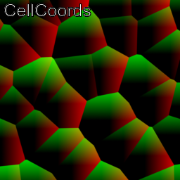
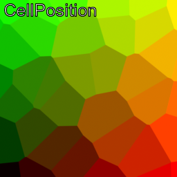
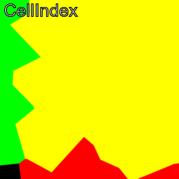

# guerilla-nodes
Collection of shaders and other utility nodes for the rendering engine [Guerilla Render](http://guerillarender.com/)

## Attributes
Nodes that can be used in Guerilla shaders.

### Voronoï nodes

This section concern all the nodes that generates Voronoï diagrams.

#### Voronoi2D
##### Description
This node allows generates two-dimensional Voronoï diagram.

##### Inputs

- Input (enum): specify which input coordinates to use.
When set to 'st', it will use first set of texture coordinates.
When set to to Coords it will use the input Coords value.
- Coords (point): coordinates to use when the input is set to 'Coords'.
- Scale (vector): Scales the input coordinates. 
- Jitter (float): Multiplication factor of how much the cell position is
jittered for the original cell center.

##### Outputs

- CellCoords (vector): returns the coordinates of the shading point relative to the cell center.
- CellPosition (point): returns the position of the cell center in which the shading point falls into.
- CellIndex (vector); returns the index of the cell in which the shading point falls into.

##### Notes

You can modify the `modifyPosition` function in the Voronoï SL Node if you need
more control on how the cell center is displaced from its original position.
By default, the function jitters the cell position by a random vector.

